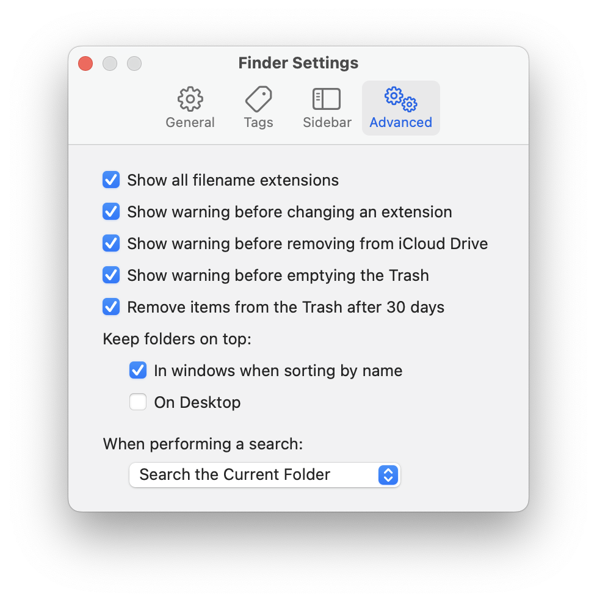
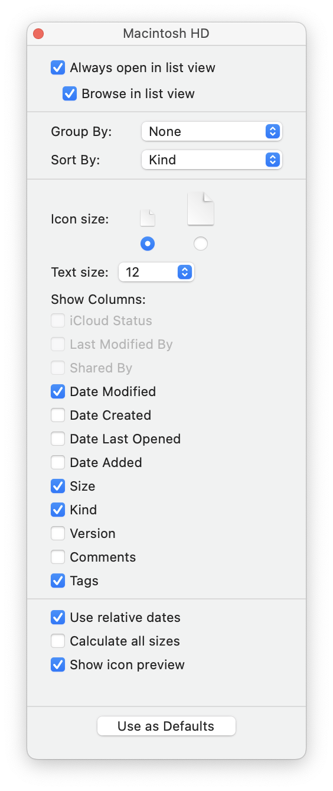
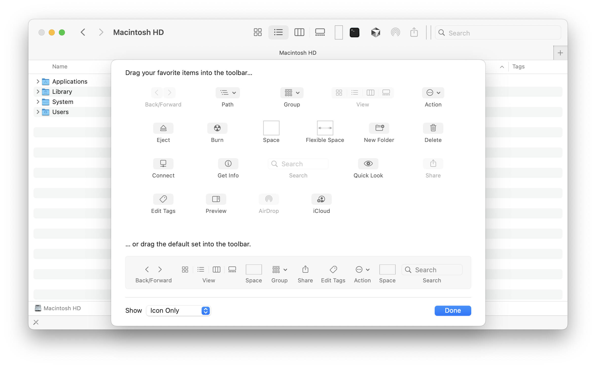

[README](../../README.md) > [Finder Setup](finder_setup.md)

# Finder Setup

## Essentials

### Finder Settings

- [ ] Adjust Sidebar in Settings to show (Settings > Sidebar):
  - Applications
  - Downloads
  - User Home
  - Macintosh HD
  - ... whichever you prefer
- [ ] Set "New Finder windows show" to "Home" or whichever you prefer (Settings > General)
- [ ] Show folders on top (Settings > Advanced > Keep folders on top > (tick) In Windows when sorting by name)
- [ ] Set "Default search scope" to "Current folder" (Settings > Advanced > Default search scope (dropdown))
- [ ] (optional) Open new folders in tabs instead of windows (Settings > General)
- [ ] (optional) Show filename extensions (Settings > Advanced > Show all filename extensions)
- should look like this after setup:

  

### Finder View Options (Finder > View)

- [ ] Show Path Bar (View > Show Path Bar)
- [ ] Show Status Bar (View > Show Status Bar)
- [ ] Hide Preview (View > Hide Preview)
- [ ] Set View Options (View > Show View Options)

  - as shown on the screenshot & save as default:

    

### Customize Toolbar

- [ ] Remove most of the toolbar buttons (Finder > View > Customize Toolbar)
- [ ] Show icons only
- My recommended setup:

- [ ] (advanced & optional) [Add custom toolbar buttons](finder_add_custom_buttons.md)

### Setup some cloud storage (recommended)

- [ ] Install Onedrive (free) [Download](https://www.microsoft.com/en-us/microsoft-365/onedrive/online-cloud-storage) / Google Drive (free) [Download](https://www.google.com/drive/download/) / use iCloud (free & preinstalled) / ...

## Finder Extensions (advanced) (for developers)

### Quick Look Extensions

Quick Look is the preview you get when you press spacebar on a file.

- [ ] PreviewText (free) [Download](https://smittytone.net/previewtext/)
  - Generate previews of textual files & files with no extensions
- [ ] (optional) PreviewCode (1$) [Download](https://smittytone.net/previewcode/)
  - Generate previews of with code highlighting supporting a buch of different languages. Natively macOS doesn't highlight code, but it does show the source code for some formats.
- [ ] (optional) PreviewMarkdown (1$) [Download](https://smittytone.net/previewmarkdown/)
  - A tool to generate previews of markdown files. Natively macOS doesn't render markdown files, but only shows the source code.
- [ ] (optional) PreviewJSON (1$) [Download](https://smittytone.net/previewjson/)
  - A tool to generate previews of highlighted JSON files. Natively macOS doesn't highlight JSON files, but shows the source code.
